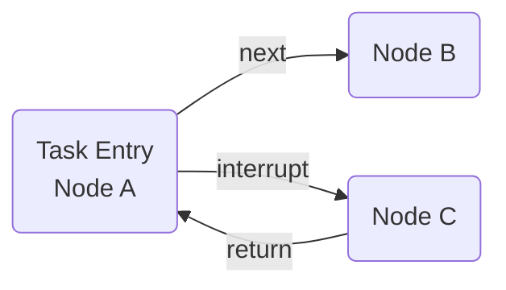
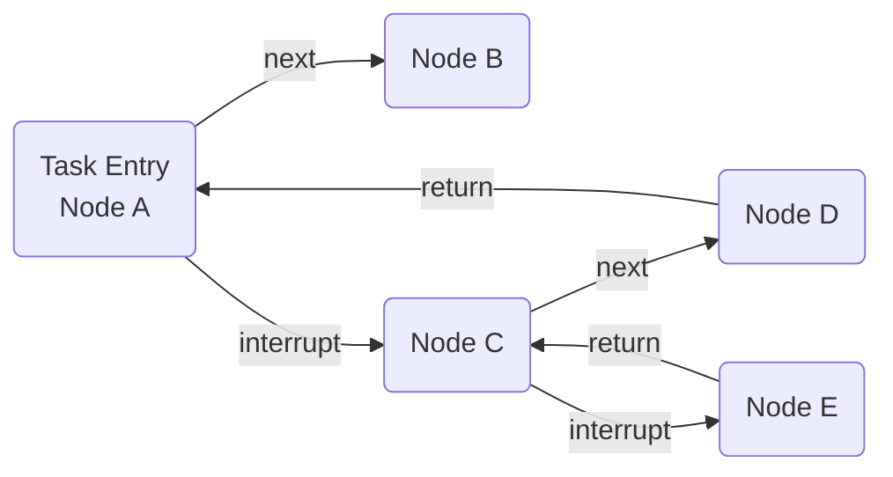
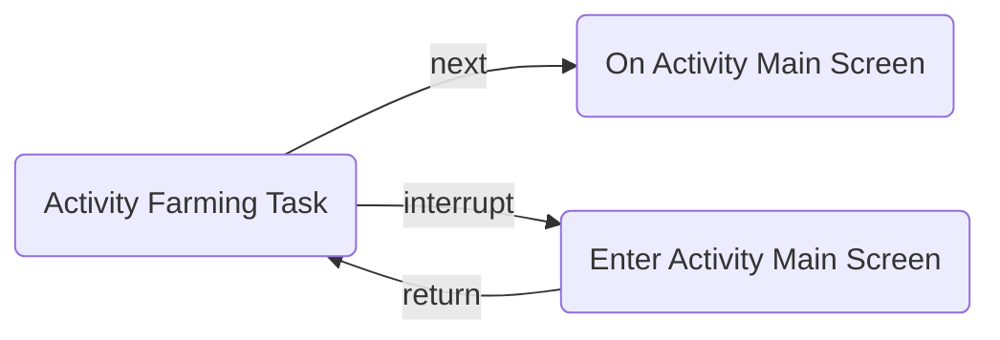

# Pipeline Writing

## Writing Standards

### Naming Conventions

To ensure the resources are aesthetically consistent, please try to follow the existing rules below.

#### Resource Naming

- For files such as images, use PascalCase, where the first letter of each word is capitalized.
- For JSON files under the `pipeline` folder, use snake_case, where words are separated by underscores and all letters are lowercase.  
  Specifically, activity-related files use PascalCase and are generally located in the `activity` folder.
- For folders under `image`, each folder corresponds to a JSON file under the `pipeline` folder. Folder names use PascalCase.  
  Specifically, JSON files in the `activity` folder correspond to images placed in `Combat/Activity`.

#### Node Naming

A node is defined as a complete `JsonObject` that conforms to the task pipeline protocol. Most nodes use PascalCase, but in some cases, `_` is used to connect prefixes and suffixes.

Prefixes are generally `Sub` or abbreviations of the current activity (e.g., `SOD` for Sound of Dusk, `EITM` for Echoes in the Mountains). (Other cases are recommended to avoid prefixes.)

Suffixes are generally `numbers` or `states`, indicating the specific stage or state of the node. (It is recommended not to add suffixes to newly written nodes.)

### Node Writing

For detailed content, refer to [Pipeline Protocol Detailed Explanation](https://github.com/MaaXYZ/MaaFramework/blob/main/docs/zh_cn/3.1-%E4%BB%BB%E5%8A%A1%E6%B5%81%E6%B0%B4%E7%BA%BF%E5%8D%8F%E8%AE%AE.md)

> [!NOTE]
>
> - `next` specifies the exit node of the current node, and `interrupt` specifies the interrupt node of the current node.
> - Nodes with a flag-like nature are often set as exit nodes to mark the completion of the current node.
> - Reduce coupling between nodes.  
> For example, `BackButton` is generally not set with `next` but is used as an "exception handler" placed in `interrupt` to ensure task flow clarity and facilitate the reuse of interrupt nodes in other tasks.
> - In some cases, a node can be added to its own `next`. (This is for situations where actions are not correctly accepted by the game or have not yet taken effect in the game.)
> - For nodes involving page switching, add `post_wait_freezes` and use an `object` as the value to set appropriate `time` and `target`.
> - For operations involving swiping, add a click operation afterward to ensure screen stability.

> [!WARNING]
>
> - Use the `inverse` field cautiously, as it may lead to unpredictable tasks.  
> If it must be used, ensure it has a preceding node with `post_wait_freezes` to ensure the state matches the expected conditions when the node is matched.
> - Use "unconditional match" nodes cautiously.  
> Nodes with the `recognition` field defaulting to `DirectHit` are considered "unconditional match" nodes.  
> Using "unconditional match" nodes may cause the program to loop on the node and freeze the task if it reaches an unexpected state without proper error handling.  
> Unless necessary, choose other logical implementations to complete the task.

#### Node Connections

Nodes are primarily connected through the `next` or `interrupt` fields.

`next` connects nodes sequentially, while `interrupt` initiates a new task chain with the current interrupt node as the entry point and returns to the current node after the task chain is completed.

A simple representation is as follows:



Making the interrupt node more complex:



To ensure a good structure for the task chain, follow these principles for node connections:

1. Nodes marking the completion of a phase task should be placed in `next`.
2. Nodes handling other conditions to match the `next` node should be placed in `interrupt`.

For example, the relationship between activity farming tasks, being on the activity main screen, and entering the activity main screen is as follows:



Here, "Enter Activity Main Screen" is not placed in `next` but in `interrupt`.

#### Next & Interrupt Node Ordering

Overall, the first node in `interrupt` has a lower priority than the last node in `next`.

Within `next` or `interrupt`, nodes should be arranged in descending order of priority, and priority inversion should not occur. For example:

```plaintext
If there is a node B that checks for a small popup and a node A that checks for the interface before the popup appears, 
and if the popup can still match A when it appears, then B should have a higher priority than A. 
Otherwise, the task may freeze at A without handling B.
```

Nodes with the same priority can be arranged in descending order of matching frequency to improve node hit rates and reduce resource consumption.

#### Comment Standards

In `pipeline.json` files, there are two types of comment fields:

1. `.*_doc$|^doc$`: Strings ending with `_doc` or exactly `doc`.
2. `.*_code$|^code$`: Strings ending with `_code` or exactly `code`.

The former provides explanations for the current node (or field), while the latter serves as placeholders for required fields. For example:

```json
{
    "EnterTheActivityMain": {
        "doc": "Enter the main screen of the current activity",
        "template_code": "Modify the template in interface.json",
        "recognition": "TemplateMatch",
        "roi": [
            885,
            123,
            340,
            183
        ],
        "action": "Click",
        "post_wait_freezes": {
            "time": 500,
            "target": [
                0,
                179,
                190,
                541
            ]
        }
    }
}
```

`doc` explains the current node.

`template_code` is a placeholder for required fields.  
The reason is that when `recognition` is `TemplateMatch`, the "template" field is required, but we want to modify it in `interface.json` instead of this JSON file. Hence, `template_code` is used as a placeholder.
