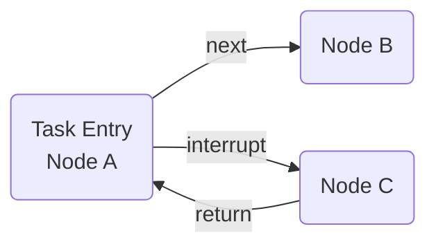
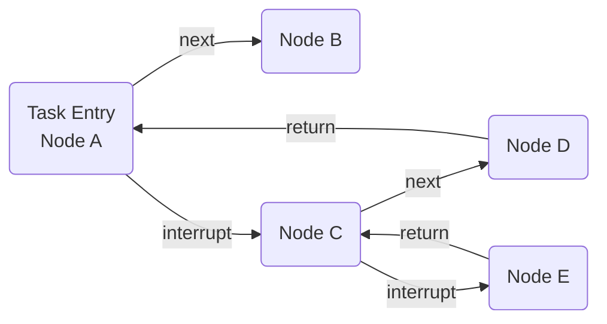
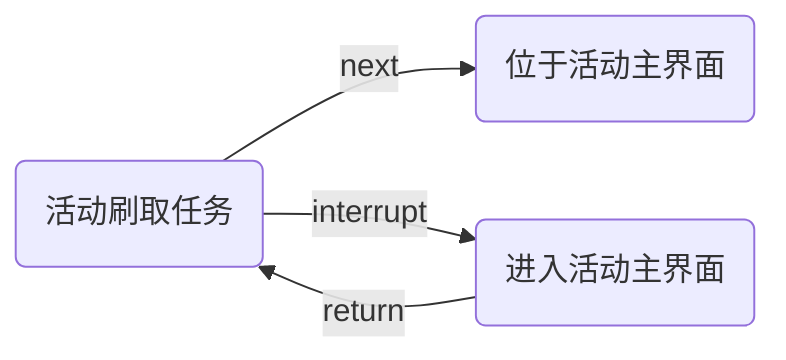

# Pipeline 编写

## 编写规范

### 命名规范

为保证资源的美观一致，请尽量遵循以下现有规则。

#### 资源命名

- 对于图片等文件，采用大驼峰命名法，所有单词的首字母都大写。
- 对于 `pipeline` 文件夹下的 json 文件名，一般采用蛇形命名法，单词之间用下划线分隔，所有字母小写，  
  特别地，专有名词的活动采取大驼峰命名法，一般在 `activity` 文件夹内。
- 对于 `image` 下文件夹，每个文件夹对应一个 `pipeline` 文件夹下的 json 文件，文件夹名采用大驼峰命名法，  
  特别地，`activity` 内 json 文件对应的 `image` 放到 `Combat/Activity` 处。

#### Node 命名

node 的定义为符合任务流水线（Pipeline）协议的一个完整的 `JsonObject`，大多数采用大驼峰命名法，特别地，部分情况下用 `_` 连接前、后缀。

前缀一般为 `Sub` 或 当前活动缩写（如 `SOD` 黄昏的音序、`EITM` 山麓的回音）等。（其他情况建议不要前缀）

后缀一般为 `数字` 或 `状态` 等，表示该 node 的具体阶段或状态。（建议新写的 node 不加后缀）

### Node 编写

具体内容参见[Pipeline 协议详细说明](https://github.com/MaaXYZ/MaaFramework/blob/main/docs/zh_cn/3.1-%E4%BB%BB%E5%8A%A1%E6%B5%81%E6%B0%B4%E7%BA%BF%E5%8D%8F%E8%AE%AE.md)

> [!NOTE]
>
> - `next` 放置当前 node 的出口 node，`interrupt` 放置当前 node 的中断 node。
> - 多将具有 Flag 性质的 node 设为出口 node，作为当前 node 完成的标志。
> - 降低 node 之间的耦合。  
> 如 `BackButton` 一般不设置 `next`，而是作为一个“异常处理”放入 `interrupt`，以便保证任务流程的清晰，并方便 interrupt node 被其它任务复用。
> - 部分情况下，可将 node 加入自身 `next` 。（存在动作未被游戏正确接受/尚未在游戏内生效的情况）
> - 在涉及切换页面的 node 中加入 `post_wait_freezes` ，并使用 `object` 作为值，设置合适的 `time` 和 `target`。
> - 涉及滑动的操作时，在后面加个点击操作，以便确保画面稳定。

> [!WARNING]
>
> - 慎用 `inverse` 字段，这可能会导致任务的不可预测。  
> 如必须使用，请保证其有带 `post_wait_freezes` 的前置 node，以保证匹配该 node 时处于预期状态。
> - 慎用“无条件匹配” node。  
> node 的 `recognition` 字段默认为 `DirectHit`。 `recognition` 字段为 `DirectHit` 的 node 即为“无条件匹配” node。  
> 使用“无条件匹配” node，可能导致任务运行到非预期状态时，程序未能正常报错，而是循环匹配该 node，造成任务卡死。  
> 如非必要，请选择其它实现逻辑完成任务。

#### Node 连接

Node 间主要通过 `next` 或 `interrupt` 字段连接。

`next`完成 node 间的串联，`interrupt`实现执行以当前 interrupt node为 entry 的新任务链，并在该任务链完成后返回当前 node。

简单表示如下：



将 interrupt node 变复杂点：



为保证任务链有一个较好的结构，请按以下原则进行 node 连接：

1. 标志完成阶段性任务的 node 应放在 `next` 中。
2. 为达到匹配 `next` 中 node 而处理其他状况的 node 应放在 `interrupt` 中。

如 活动刷取任务、位于活动主界面、进入活动主界面 三者关系如下：



这里“进入活动主界面”就不会放在 `next` ，而是放入 `interrupt` 。

#### Next & Interrupt Node 排序

总体上，`interrupt` 第一个 node 比 `next` 最后一个 node 低一优先级。

在 `next` 或 `interrupt` 内部，统一先按照优先级由高到低顺序排列，不能出现优先级倒挂的情况。举例：

```plaintext
现有判断一个小弹窗的 node B，和判断跳出弹窗前界面的 node A。
如果弹窗出现时依旧能匹配到A，则B的优先级应该高于A，否则会出现无法处理B而卡死于A的情况。
```

同一优先级内的 node，可按照匹配频率由高到低顺序排列，以便提高 node 命中率，降低资源消耗。

#### 注释规范

`pipeline.json` 文件中，注释共两种属性字段：

1. `.*_doc$|^doc$`： 以 _doc 结尾的字符串或者正好是 doc 的字符串。
2. `.*_code$|^code$`：以 _code 结尾的字符串或者正好是 code 的字符串。

前者为对当前 node（或某字段）的说明，后者为对必填字段的占位。举例：

```json
{
    "EnterTheActivityMain": {
        "doc": "进入当期活动主界面",
        "template_code": "在interface.json中修改template",
        "recognition": "TemplateMatch",
        "roi": [
            885,
            123,
            340,
            183
        ],
        "action": "Click",
        "post_wait_freezes": {
            "time": 500,
            "target": [
                0,
                179,
                190,
                541
            ]
        }
    }
}
```

`doc` 为当前 node 说明。

`template_code` 为必填字段占位，
原因是 `recognition` 为 `TemplateMatch` 时， "template" 字段必填，但我们想在 `interface.json` 中修改，而不是该 json 文件中。故用 `template_code` 占位。
